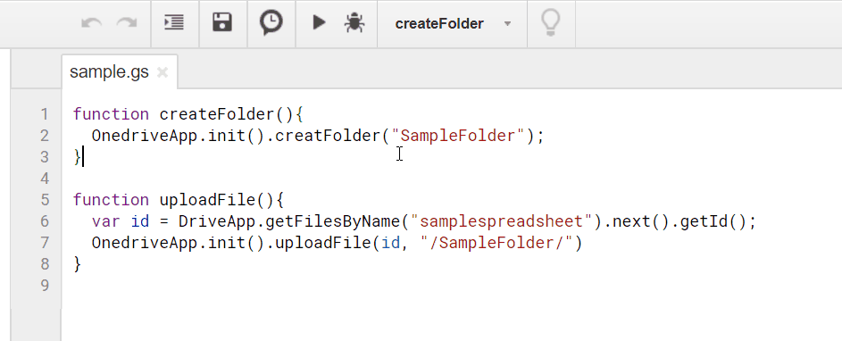
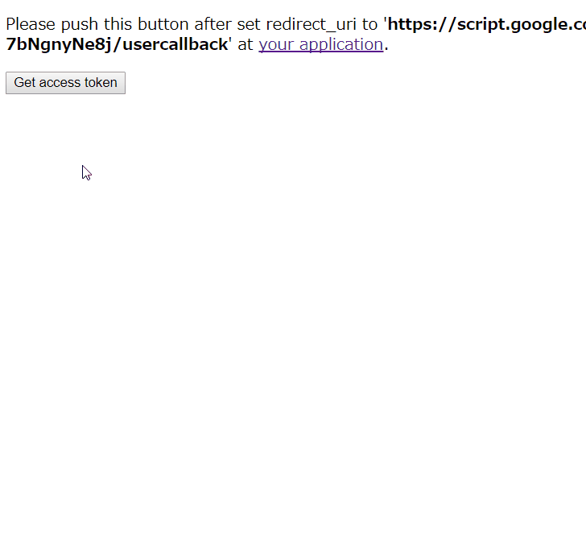

# OnedriveApp

This is a library of Google Apps Script for using Microsoft OneDrive.

## Feature
This library can carry out following functions using OneDrive APIs.

1. [Retrieve access token and refresh token using client_id and client_secret](#authprocess)
1. [Retrieve file list on OneDrive.](#Retrievefilelist)
1. [Delete files and folders on OneDrive.](#Deletefilesandfolders)
1. [Create folder on OneDrive.](#Createfolder)
1. [Download files from OneDrive to Google Drive.](#Downloadfiles)
1. [Upload files from Google Drive to OneDrive.](#Uploadfiles)

## Demo

In this demonstration, it creates a folder with the name of "SampleFolder" on OneDrive, and then a spreadsheet file is uploaded to the created folder. The spreadsheet is converted to excel file and uploaded. The scripts which was used here is as follows.

~~~javascript
function createFolder(){
  OnedriveApp.init(PropertiesService.getScriptProperties()).creatFolder("SampleFolder");
}

function uploadFile(){
  var id = DriveApp.getFilesByName("samplespreadsheet").next().getId();
  OnedriveApp.init(PropertiesService.getScriptProperties()).uploadFile(id, "/SampleFolder/")
}
~~~

## How to install
- Open Script Editor. And please operate follows by click.
- -> Resource
- -> Library
- -> Input Script ID to text box. Script ID is **``1wfoCE1mCQpGQZZ9CrWFY_NvA9iRxkNbxN_qTGSBkRkmn8I2eguLVwfZs``**.
- -> Add library
- -> Please select latest version
- -> Developer mode ON (If you don't want to use latest version, please select others.)
- -> Identifier is "**``OnedriveApp``**". This is set under the default.

[If you want to read about Libraries, please check this.](https://developers.google.com/apps-script/guide_libraries).

* The method of ``downloadFile()`` and ``uploadFile()`` use Drive API v3. But, don't worry. Recently, I confirmed that users can use Drive API by only [the authorization for Google Services](https://developers.google.com/apps-script/guides/services/authorization). Users are not necessary to enable Drive API on Google API console. By the authorization for Google Services, Drive API is enabled automatically.

# Retrieve access token and refresh token for using OneDrive

**Before you use this library, at first, please carry out as follows.**

## 1. OneDrive side
1. Add new application at [https://apps.dev.microsoft.com](https://apps.dev.microsoft.com).
    - Enable "Guided Setup".
1. Retrieve application ID. This is client ID.
1. By creating new password, retrieve application secret. This is client secret.
1. Click save button.

## 2. Google side
Please copy and paste following script (``doGet(e)``) on the script editor installed the library, and import your ``client_id`` and ``client_secret``.

~~~javascript
function doGet(e){
  var prop = PropertiesService.getScriptProperties();
  OnedriveApp.setProp(
    prop,
    "### client id ###", // <--- client_id
    "### client secret ###" // <--- client_secret
  )
  return OnedriveApp.getAccesstoken(prop, e);
}
~~~

- On the Script Editor
    - File
    - -> Manage Versions
    - -> Save New Version
    - Publish
    - -> Deploy as Web App
    - -> At Execute the app as, select **"your account"**
    - -> At Who has access to the app, select **"Only myself"**
    - -> Click "Deploy"
    - -> Click **"latest code"** (By this click, it launches the authorization process.)

## 3. OneDrive side
When you click **"latest code"**, new tab on your browser is launched and you can see ``Please push this button after set redirect_uri to 'https://script.google.com/macros/s/#####/usercallback' at your application.``.

- Copy the URL, and click the link of ``your application``.
- Add platform. Select WEB.
- Input the copied URL to redirect uri.
- Click save button.

## 4. Google side
1. Back to the page with ``Get access token`` button.
1. Click the button.
1. Authorize.
1. You can see ``Retrieving access token and refresh token was succeeded!``. If that is not displayed, please confirm your client_id and client_secret again.
1. Access token and refresh token are shown. And they are automatically saved to your PropertiesService. **You can use OnedriveApp from now.**

This process can be seen at following demonstration.

**Please run this process only one time on the script editor installed this library.** By only one time running this, you can use all of this library. After run this process, you can undeploy web apps.

If your OneDrive Application was modified, please run this again.

Or, if you can retrieve refresh token by other script, please check [here](https://gist.github.com/tanaikech/d9674f0ead7e3320c5e3184f5d1b05cc).

# Usage
## At First, Please Run This!
**After it retrieves the refresh token, please run ``OnedriveApp.setProp()``. ``OnedriveApp.setProp()`` inputs the parameters (client id, client secret, redirect uri and refresh token) for the authorization to ``PropertiesService``.**

~~~javascript
var res = OnedriveApp.setProp(client_id, client_secret, redirect_uri, refresh_token);
~~~

When it runs this, parameters in the ``PropertiesService`` is returned.

## 1. Retrieve file list on OneDrive

~~~javascript
var prop = PropertiesService.getScriptProperties();
var odapp = OnedriveApp.init(prop);
var res = odapp.getFilelist("### folder name ###");
~~~

Filenames and file IDs are returned.

If ``"### folder name ###"`` is not inputted (``var res = odapp.getFilelist()``), files and folders on the root directory are retrieved.

## 2. Delete files and folders on OneDrive.
When a file is deleted,

~~~javascript
var prop = PropertiesService.getScriptProperties();
var odapp = OnedriveApp.init(prop);
var res = odapp.deleteItemByName("### filename ###");
~~~

When a folder is deleted,

~~~javascript
var prop = PropertiesService.getScriptProperties();
var odapp = OnedriveApp.init(prop);
var res = odapp.deleteItemByName("/### folder name ###/");
~~~

In the case of folder, please enclose it in ``/``.

If you want to delete files and folders using item ID, please use as follows.

~~~javascript
var prop = PropertiesService.getScriptProperties();
var odapp = OnedriveApp.init(prop);
var res = odapp.deleteItemById("### item ID ###");
~~~

### Note :
**If you delete a folder, the files in the folder are also deleted. Please be careful about this.**

## 3. Create folder on OneDrive.

~~~javascript
var prop = PropertiesService.getScriptProperties();
var odapp = OnedriveApp.init(prop);
var res = odapp.creatFolder("### foldername ###", "/### path ###/");
~~~

Created folder name and ID are returned. If you want to create a folder of ``newfolder`` in the folder of ``/root/sample1/sample2/``, please use as follows. If there is no folder ``sample2`` on your OneDrive, following script creates ``sample2`` and ``newfolder``, simultaneously.

~~~javascript
var prop = PropertiesService.getScriptProperties();
var odapp = OnedriveApp.init(prop);
var res = odapp.creatFolder("newfolder", "/sample1/sample2/");
~~~

## 4. Download files from OneDrive to Google Drive.

~~~javascript
var prop = PropertiesService.getScriptProperties();
var odapp = OnedriveApp.init(prop);
var res = odapp.downloadFile("### file with path ###", convert from Microsoft to Google (true or false), "### Folder ID on Google Drive ###");
~~~

Downloaded file name and ID on Google Drive are returned. When a file is downloaded from OneDrive to Google Drive, if the file is Microsoft Office Docs, you can select whether the file is converted to Google Docs. If you want to convert, you can use following sample.

~~~javascript
var prop = PropertiesService.getScriptProperties();
var odapp = OnedriveApp.init(prop);
var res = odapp.downloadFile("/SampleFolder/sample.xlsx", true, "### Folder ID on Google Drive ###");
~~~

In this case, Excel file is converted to Google Spreadsheet, and imported to the folder ID. If you don't want to convert, you can use following sample. If the folder ID is not set, the file is created to root directory on your Google Drive.

~~~javascript
var prop = PropertiesService.getScriptProperties();
var odapp = OnedriveApp.init(prop);
var res = odapp.downloadFile("/SampleFolder/sample.xlsx", false, "### Folder ID on Google Drive ###");
~~~

In this case, only an Excel file is downloaded to Google Drive.

If you use following simple script, the file ``sample.xlsx`` is just created to root directory.

~~~javascript
var prop = PropertiesService.getScriptProperties();
var odapp = OnedriveApp.init(prop);
var res = odapp.downloadFile("/SampleFolder/sample.xlsx");
~~~

### Note :
**From my previous experiences, I think that the maximum response size using URL Fetch is about 10 MB. And furthermore, there are the limitations for the download size in 1 day ([URL Fetch data received 100MB / day](https://developers.google.com/apps-script/guides/services/quotas#current_limitations)). So when you use this download method, please be careful the file size.**

## 5. Upload files from Google Drive to OneDrive.

~~~javascript
var fileid = "### file id ###";
var prop = PropertiesService.getScriptProperties();
var odapp = OnedriveApp.init(prop);
var res = odapp.uploadFile(fileid, "/### folder name on OneDrive ###/");
~~~

Uploaded filename and ID on OneDrive are returned. In the case of folder, please enclose it in ``/``.

When you want to upload a Spreadsheet on Google Drive to a folder of ``SampleFolder``, the Spreadsheet is converted to Excel file and uploaded to OneDrive. As a sample, when it uploads Spreadsheet to ``/SampleFolder/`` on OneDrive, the script is as follows.

~~~javascript
var fileid = "### file id ###";
var prop = PropertiesService.getScriptProperties();
var odapp = OnedriveApp.init(prop);
var res = odapp.uploadFile(fileid, "/SampleFolder/sample.xlsx")
~~~

At the following script, a file with the file id is uploaded to the root directory on OneDrive.

~~~javascript
var fileid = "### file id ###";
var prop = PropertiesService.getScriptProperties();
var odapp = OnedriveApp.init(prop);
var res = odapp.uploadFile(fileid)
~~~

### Note :
**About this upload, in this library, [the resumable upload](https://dev.onedrive.com/items/upload_large_files.htm) is used for uploading files. So you can upload files with large size to OneDrive. But the chunk size is 10 MB, because of [the limitation of URL Fetch POST size on Google](https://developers.google.com/apps-script/guides/services/quotas#current_limitations). The file with large size is uploaded by separating by 10 MB. There are no limitations for upload size in one day.**

# Contact
If you found bugs, limitations and you have questions, feel free to mail me.

e-mail: tanaike@hotmail.com

# Update History
* v1.0.0 (August 16, 2017)

    Initial release.

* v1.0.1 (August 21, 2017)

    [Added a method for retrieving access token and refresh token using this library.](#authprocess)

* v1.0.2 (August 21, 2017)

    [Moved the instance of ``PropertiesService.getScriptProperties()`` to outside of this library. When there is the ``PropertiesService.getScriptProperties()`` inside the library, it was found that the parameters that users set was saved to the library. So this was modified. I'm sorry that I couldn't notice this situation.](#authprocess)

* v1.1.0 (September 24, 2017)

    [From this version, retrieving access token and refresh token became more easy.](#authprocess)

* v1.1.1 (July 28, 2018)

    A serious bug was removed. I had forgot that it added setProp(). I'm really sorry for this. And thank you so much jesus21282.

# Etc
If you want the sample script for node.js, please check [here](https://gist.github.com/tanaikech/22bfb05e61f0afb8beed29dd668bdce9).

[TOP](#TOP)
